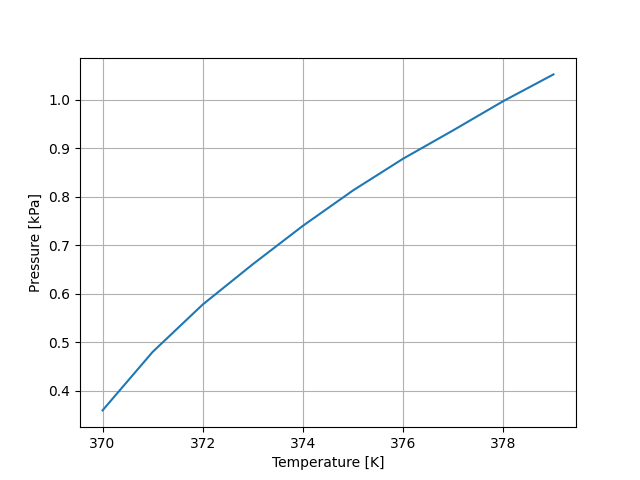

# Gibbs-Duhem integrator
Gibbs-Duhem integration is a technique for finding the coexistence curve between two different phases for a given substance. The technique utilizes the Gibbs-Duhem equation to find a new point along the coexistence curve, given a point. Therefore, in principle all points on a coexistence curve can be found from Gibbs-Duhem integration when a starting point, (T0, P0), is given. The starting point is usually obtained from a Gibbs ensemble Monte Carlo (GEMC) simulation.

In this package, we use [LAMMPS](https://lammps.sandia.gov/) for all the simulations. We have already developed a light-weight [LAMMPS python wrapper](https://github.com/evenmn/lammps-simulator) that will be used. TIP4P is still the only supported force-field.

## Basic usage

### Run Gibbs-Duhem integration
To run the Gibbs-Duhem integration, we need to import the GibbsDuhem object from this package and a computer object from `lammps_simulator.computer`. Here, we will use the `CPU` object:
``` python
from gibbsduhem import GibbsDuhem
from lammps_simulator.computer import CPU
```
`GibbsDuhem` takes initial temperature and pressure as arguments:
``` python
gibbsduhem = GibbsDuhem(T_init=370.0, p_init=0.36)
```
The two boxes with water and vapor, respectively, have to set with initial densities and initial number of particles. The densities have to be the ones found from the GEMC simulations.
``` python
gibbsduhem.set_box_A(rho=0.970, nx=6, ny=6, nz=6)
gibbsduhem.set_box_B(rho=2.2e-4, nx=6, ny=6, nz=6)
```
Here, `nx`, `ny` and `nz` are the number of particles in x, y and z-direction, respectively. Now, we are ready to run the Gibbs-Duhem simulation. Running on 4 CPU cores with the "lmp_mpi" executable with step length 1.0 is done by the following lines:
``` python
computer = CPU(num_procs=4, lmp_exec="lmp_mpi")
gibbsduhem.run(computer=computer, dT=1.0)
```

### Analyzing output files
To get an output file, one has to use the `run` argument `write`:
``` python
gibbsduhem.run(computer=computer, dT=1.0, write="output.dat")
```
This output file can then be analyzed using the `Read` object:
``` python
from gibbsduhem import Read
output = Read("output.dat")
```
Then, the file can be read column-wise into numpy arrays using the `find` method:
``` python
temp = output.find("T")
press = output.find("p")
```
Finally, the numpy arrays can be plotted
``` python
import  matplotlib.pyplot as plt
plt.plot(temp, press)
plt.xlabel("Temperature [K]")
plt.ylabel("Pressure [kPa]")
plt.grid()
plt.show()
```
The plot will then look like this:

